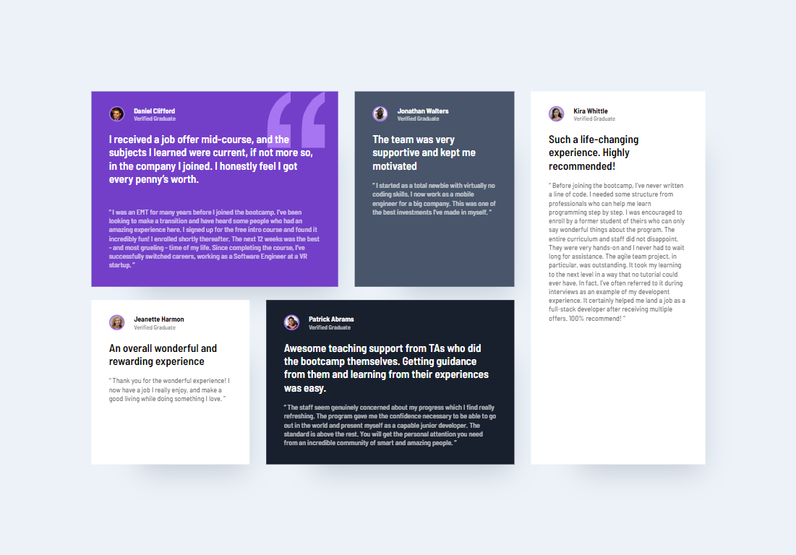

# Frontend Mentor - Testimonials grid section solution

This is a solution to the [Testimonials grid section challenge on Frontend Mentor](https://www.frontendmentor.io/challenges/testimonials-grid-section-Nnw6J7Un7). Frontend Mentor challenges help you improve your coding skills by building realistic projects. 

## Table of contents

- [Overview](#overview)
  - [The challenge](#the-challenge)
  - [Screenshot](#screenshot)
  - [Links](#links)
- [My process](#my-process)
  - [Built with](#built-with)
  - [What I learned](#what-i-learned)
  - [Useful resources](#useful-resources)
- [Author](#author)

## Overview

### The challenge

Users should be able to:

- View the optimal layout for the site depending on their device's screen size

### Screenshot




-Desktop(1440px) and Mobile(375px) versions.

### Links

- Solution URL: [Add solution URL here](https://your-solution-url.com)
- Live Site URL: [Add live site URL here](https://your-live-site-url.com)

## My process

### Built with

- Semantic HTML5 markup
- CSS custom properties
- Flexbox
- CSS Grid
- Mobile-first workflow

### What I learned

- How to resize containers in the grid with grid-column / grid-row properties.

```css
.testimonials-main-grid {
        display: grid;
        column-gap: 30px;
        padding: 165px;
    }

    .card1 {
        grid-column: 1/3;
    }

    .card2 {
        grid-column: 3;
    }
    
    .card3 {
        grid-column: 1;
    }

    .card4 {
        grid-column: 2/4;
        grid-row: 2/3;
    }

    .card5 {
        grid-column: 4;
        grid-row: 1 / span 2;
    }

```

### Useful resources

- [CSS Grid Item](https://www.w3schools.com/css/css_grid_item.asp) - This helped me with moving containers inside the grid. I really liked this pattern and will use it going forward.

## Author

- Linkedin - [Nika Merabishvili](https://www.linkedin.com/in/nikusha-merabishvili/)

